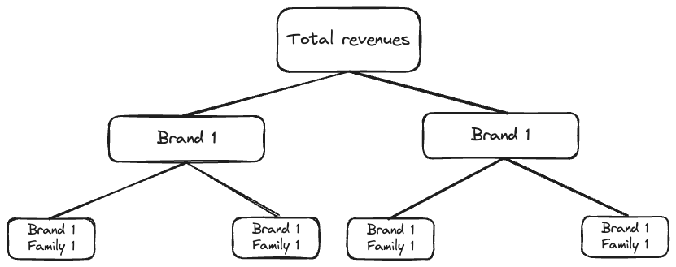

# Use case deporvillage

__Project structure__  

```
├── utils
│   ├── utils_features_family.py  
│   ├── utils_features.py
│   ├── utils_models.py
│   ├── utils_plots.py
│   ├── utils_preprocessing.py
│
├── 1_data_exploration.ipynb
├── 2_model_naive.ipynb
├── 3_model_lightGBM.ipynb
├── 2_model_hierarchical.ipynb
├── 2_model_hierarchical_categories.ipynb
```


> __Project description__:  
> You are required to generate a prediction of the total amount to sell during the year
2024-09-01 → 2025-08-31 for each brand+family. The goal of this prediction is to generate a
budget (per brand+family) for the purchasing team.  
> 
> You are given two data files, one with information about products, and another containing
historic sales data.  
> 
> Please hand in one (or several, if required) ipynb file with the data exploration, modelling
and outcome analysis; and a data file with the generated predictions.  
> 
> The developed ML solution does not need to be finetuned, since the goal is to evaluate your
approach to the process, not the specific result.  
> 
> Then answer the following questions:  
> 1. What metric have you used and why have you selected this particular metric? Is
there any drawback that comes from using this metric?  
> 2. What error can we expect from the generated predictions? How many units do you
estimate will be left unsold at the end of the year? How can we minimize this?  
> 3. If you had the time to develop this project further, what improvements would you
consider testing?  
> 4. How would you make these predictions available to the purchasing team? Please
write a few pros and cons of every alternative proposed.  
> 5. How would you evaluate the performance of this model in production? How would
you justify those numbers to the purchasing team?  
> 6. If there is any pandemic or economical crisis, which strategy would you propose to
make sure the model can be adapted to it?   


## Introduction

### Technical overview
Multiple approaches would be possible. In this case, since we have to make predictions a 
year ahead, we would like to formulate it in forecasting terms: the time component will
be taken into account without shuffling dates. Features will have lagged values and we will
be careful with data leakage issues.  

Specifically this would be a hierarchical forecasting project. Hierarchical because of the
structure of the data which could be grouped following multiple dimensions or, to say it
differently, represented with a DAG (directed acyclic graph). Items can be aggregated at 
the brand + family level, then into brands and then globally. Or into families and the 
globally. Same with other categorical columns.  

  

The forecast level of aggregation is *Brand + Family*. Even if this already aggregating 
multiple products, it still generates many intermittent time series with low volumes and
high variance. Besides, since the data is daily, predicting a year ahead means predicting 365 days ahead.
Which is a lot.  
Therefore it would be better to aggregate the time dimension with weekly or monthly frequency.  
Both the weekly and monthly approaches were tested and the code is general enough to manage them.  
The weekly approach was later discarded, being it too fine for this task.  

In principle we have 2 possible approaches:

#### OPTION 1: Predict Quantity at Brand + Family Level, then Convert to Revenue  

1.	Aggregate historical quantity sold at (brand, family, date).
2.	Predict total quantity for the future period. Target Variable: total_quantity per brand/family for the forecast period.
3.	Convert to revenue using an estimated PVP per (brand, family), such as a Weighted PVP based on sales distribution:
$$\text{AvgPvp} = \frac{\sum (\text{quantity} \times \text{pvp})}{\sum \text{quantity}}$$

- Pros:  
	•	More granular, allowing adjustments based on price changes.  
	•	If PVP changes, we can easily recalculate revenue.  

- Cons:  
	•	Requires an extra step and assumes PVP remains constant or follows a simple trend.    

This is probably better is PVP fluctuates.  


#### OPTION 2: Directly Predict Revenue (Sales)  

Target Variable: $\text{total revenue} = \text{total quantity sold} × PVP$  

1.	Aggregate historical revenue at (brand, family, date).
2.	Predict total revenue for the future period. 

- Pros:  
	•	Simpler approach with fewer calculations.
	•	Directly aligns with the budgeting goal.  
    •   No need to worry about varying PVP within a brand + family.

- Cons:  
	•	If prices fluctuate, the model won’t capture it properly.  
	•	Less flexibility—harder to analyze quantity vs. price effects separately.  

Assumes PVP is stable.   

Since the price of all items is constant over time, it makes sense to directly 
predict the revenues. Note that the code is general enought to predict
the number of items sold for each brand + family. However, since the *pvp* is 
constant over time for each brand + family, both approaches are equivalent.  


### Business overview

Since the goal of this prediction is to generate a budget (per brand + family) for the purchasing team, it makes sense (also
from a business perspective) to directly predict revenues.  

We should consider the following trade-offs:  
- Model accuracy: Ensuring the company doesn’t make significant errors in the overall budget allocation, as such mistakes could be financially painful.
- Granular accuracy: Achieving accuracy at the family + brand level to avoid empty stock for specific products.

These considerations directly influence the choice of evaluation metric:

- RMSE (Root Mean Square Error):
    - Penalizes large errors more heavily due to the squaring of differences, which is desirable when big deviations (e.g., underestimating revenue or overspending) carry significant cost.  
    - However, RMSE can disproportionately emphasize large-scale time series (e.g., major brands with higher revenues), reducing the influence of smaller time series on overall performance evaluation.  
- MAPE (Mean Absolute Percentage Error):  
    - Provides a percentage-based error, allowing for comparison across time series with varying revenue scales (e.g., large vs. small revenue series).  
    - However, MAPE can disproportionately penalize smaller time series or instances where actual revenues are low.  

A complete evaluation would require input from the business team to better understand the company’s business model, the impact of certain choices, and its overall strategy.    

In the accompanying notebooks, both metrics will be displayed; however, RMSE will be our primary focus. Generally, it’s not ideal to use multiple metrics when comparing models. In this case, we include both to observe whether any model shows a particularly wide gap between RMSE and MAPE.  


## Problem formulation

__Target variable__: *pvp*  
__Frequency__: *Monthly*  
__Aggregation key__: *Brand + Family*  
__Forecasting horizon__: *12 months*  
__Metric__: *RMSE*


## Modelling

The code implements multiple forecasting approaches.  

### Naive models

Baseline before implementing more advanced models.  
Note that in many forecasting problems these baselines might be not so easy to beat.  

- NaiveLag: propagates the last observation
- NaiveRollingMean: propagates the average of the last observations

### LigthGBM

Classical boosted approach.  
It adapts well to many situations and might be good here that we have many categorical columns.  
It might also be a good idea consideriong that the forecasting horizon is very large.  
This would probably outperform the other models if we were working with daily/weekly data.
Unfortunately there are not enough samples once we aggregate at the monthly level.

### Hierarchical models

What It Is   
- Hierarchical forecasting aggregates data at higher levels (e.g., brand level or total sales) to compensate for sparsity at lower levels (e.g., brand + family).   
- Predictions are made at the higher levels and disaggregated down to smaller groups (e.g., brand-family) using proportions.   
  
Steps to Implement:

1.	Aggregate to Higher Levels:   
	- Aggregate sparse brand-family data up to broader levels:   
	- Brand level: brand_total_sales  
	- Family level: family_total_sales  
	- Overall total: global_total_sales  
	- Use the aggregated time series to train the model.  
2.	Forecast at Higher Levels:   
	- Predict sales at the aggregated levels using richer historical data.  
3.	Disaggregate Forecasts:  
	- Split the higher-level forecasts back down to the brand-family level using historical proportions. For example:
$\text{BrandFamilyForecast} = \text{BrandForecast} \times \frac{\text{BrandFamilySales}}{\text{BrandTotalSales}}$  
4.	Smooth Proportions for Stability:  
	- Use smoothed historical proportions (e.g., rolling averages) to prevent overfitting to noisy historical proportions.   


Multiple implementation were tested:
- Forecast with the overall time series vs forecast with the brand time series
- Forecast with Sarimax vs forecast with Exponential smoothing

## Conclusions

None of the models was fine tuned and we are just analysis gross results.  
However it looks like the hierarchical model gives the better results.  
This was somehow expected since the aggregated forecast is the sum of multiple categories with different seasonalities.
For a complete storytelling, please refer to the notebooks.


# Questions

> 1. What metric have you used and why have you selected this particular metric? Is
there any drawback that comes from using this metric?  

This question has already been addressed a bit in the introduction.
Basically I've been considering 2 metrics RMSE and MAPE.  
Here are some considerations about pros and cons:  

1.	RMSE (Root Mean Square Error)  
    Why use RMSE?  
        - It penalizes large errors more heavily due to the squaring of differences, which can be desirable for scenarios where big deviations (e.g., underestimating revenue or overspending) are costly.  
        - It’s interpretable, as it’s in the same unit as the predicted variable (revenues).  
        Drawbacks:  
        - RMSE can give disproportionate weight to large-scale time series (e.g., big brands with higher revenue), making smaller time series less influential in overall performance evaluation.  
        - It might not align well with relative performance for low-sales families, as absolute errors dominate.  
2.	MAPE (Mean Absolute Percentage Error)  
    Why use MAPE?  
        - It gives a percentage-based error, which can help compare model performance across different time series with varying scales (large vs. small revenue series).  
        - Useful for ensuring good relative accuracy at the brand+family level, where small brands/families matter as much as large ones.  
    Drawbacks:  
        - MAPE can disproportionately penalize small time series or instances where actual revenues are close to zero (division by a small number makes MAPE explode).  
        - Less interpretable than RMSE because it’s percentage-based.  

Obviously he final metric could only be decided with the business. In this case I decided to use RMSE in order to
minimise financial issues in the budged allocation.  
Like I previously mentioned, it would be desirable to take into account the stock levels of items with less volumes.  


> 2. What error can we expect from the generated predictions? How many units do you
estimate will be left unsold at the end of the year? How can we minimize this?  

How to Minimize Unsold Inventory:
1.	Buffer Stock Optimization: Adjust purchase quantities to account for forecast uncertainty 
and incorporate safety stock levels based on historical variance.  
2.	Dynamic Reforecasting: Continuously monitor sales trends and reforecast quarterly or 
monthly to refine predictions.  
3.	Use Confidence Intervals: Provide the purchasing team with confidence bounds around 
forecasts (e.g., P90 and P10 predictions) to prepare for under or overperformance scenarios.  
4.	Collaborate with Stakeholders: Cross-verify forecasts with marketing or operational 
teams to factor in upcoming promotions, price changes, or external influences.  


> 3. If you had the time to develop this project further, what improvements would you
consider testing?  

1.	Feature Engineering:  
    - Include additional external variables such as economic indicators, seasonality (holidays, 
    weather), and promotional campaigns.  
    - Incorporate lagged features and trends at multiple granularities.  
2.	Advanced Modeling Techniques:  
    - Test more sophisticated forecasting models like Prophet, Neural Basis Expansion Analysis 
    (N-BEATS), or Temporal Fusion Transformers (TFT).  
    - Explore ensemble models combining traditional time-series techniques (e.g., SARIMAX) with 
    machine learning models like LightGBM.  
3.	Hyperparameter Tuning:  
    - Use grid search or Bayesian optimization to fine-tune model parameters for better results.  
4.	Better Hierarchical Aggregation:  
    - Test reconciliation methods like bottom-up reconciliation, top-down reconciliation, or optimal 
    reconciliation to ensure coherence across levels of aggregation.  
5.	Granularity Improvements:    
    - Assess predictions at different levels (weekly vs. monthly). While monthly aggregation was 
    chosen for this project, weekly predictions could capture finer temporal dynamics.  
6.	Scenario Testing:  
    - Simulate scenarios with different sales growth rates, economic shifts, or demand shocks to 
    evaluate model robustness.  
 

> 4. How would you make these predictions available to the purchasing team? Please
write a few pros and cons of every alternative proposed.  

- Option 1: Static Report (e.g., Excel/CSV)
	Description: Provide a detailed Excel file with brand-family forecasts, confidence intervals, and summary statistics.
	Pros:
	- Easy to distribute and interpret.
	- Requires minimal technical infrastructure.  
	Cons:
	- No interactivity or real-time updates.
	- Stakeholders cannot adjust scenarios dynamically.

- Option 2: Interactive Dashboard (e.g., Power BI, Tableau)
	Description: Develop a dashboard to visualize forecasts, historical trends, and potential scenarios.
	Pros:
	- Highly interactive and visually intuitive.
	- Enables real-time data filtering and drill-downs.  
	Cons:
	- Requires some training for users.
	- Relies on maintaining infrastructure for dashboard hosting.

- Option 3: Automated API Integration
	Description: Integrate predictions into the purchasing team’s software via an API.
	Pros:
	- Seamless integration with operational workflows.
	- Fully automated, reducing manual work.
	Cons:
	- Requires technical implementation and maintenance.
	- May be overkill if the team does not need frequent updates.


> 5. How would you evaluate the performance of this model in production? How would
you justify those numbers to the purchasing team?  


> 6. If there is any pandemic or economical crisis, which strategy would you propose to
make sure the model can be adapted to it?  

1.	Incorporate External Shocks:  
    - Include macroeconomic indicators (e.g., GDP growth, unemployment rates) as input features to model external shocks.  
2.	Adaptive Learning:  
    - Implement online learning algorithms that can adjust weights dynamically as new data arrives.  
    - Use shorter retraining cycles to incorporate recent trends more effectively.  
3.	Scenario Planning:  
    - Generate forecasts for multiple scenarios (e.g., optimistic, moderate, pessimistic).  
    - Collaborate with stakeholders to plan purchasing budgets for each scenario.  
4.	Diversification and Flexibility:  
    - Encourage flexible contracts with suppliers to adjust purchasing volumes based on updated forecasts.  
5.	Early Warning System:  
    - Set up automated anomaly detection to quickly identify deviations in sales patterns and trigger reforecasting workflows.  
